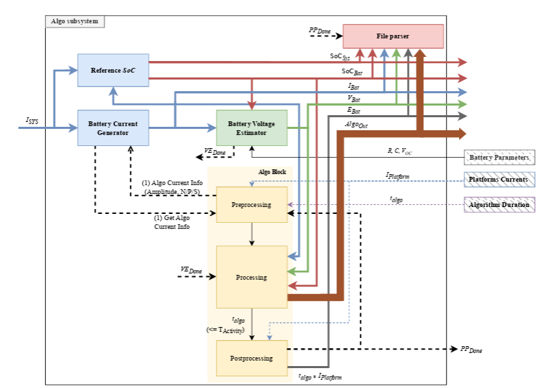
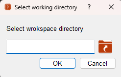
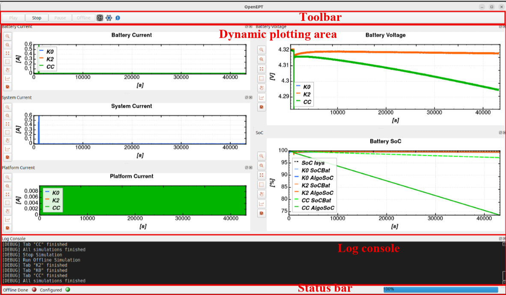
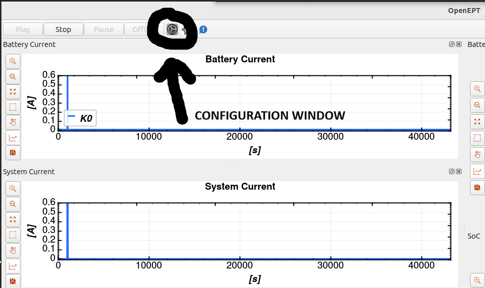
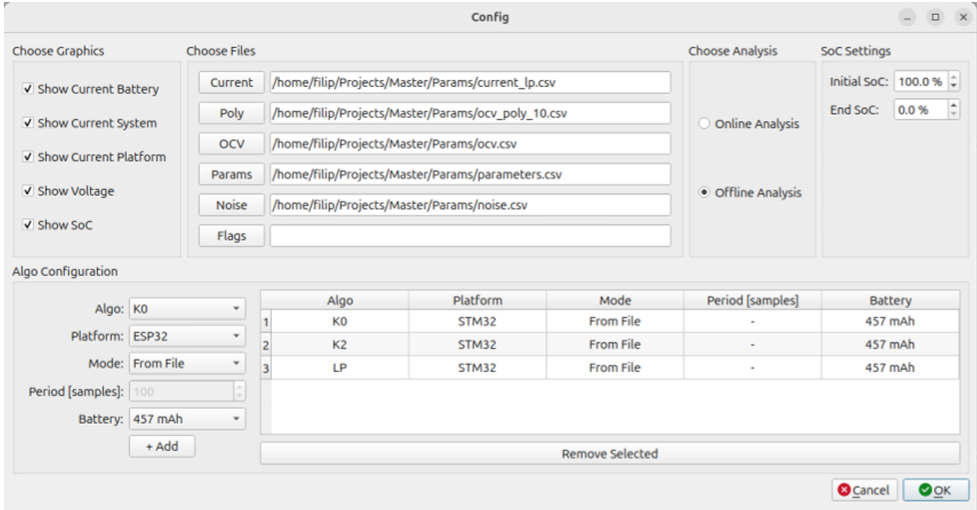
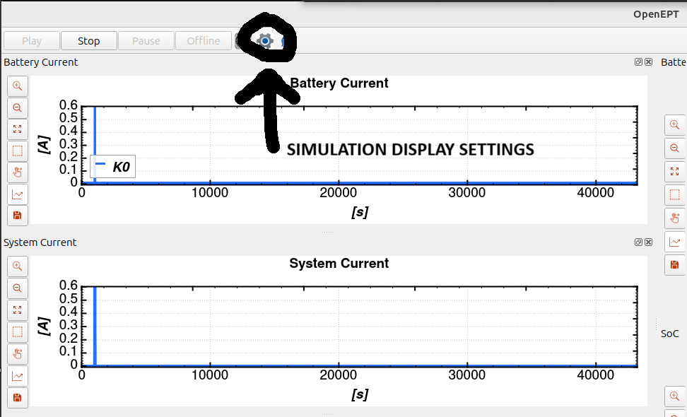
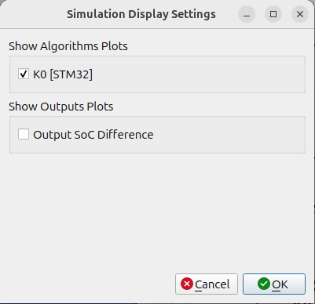
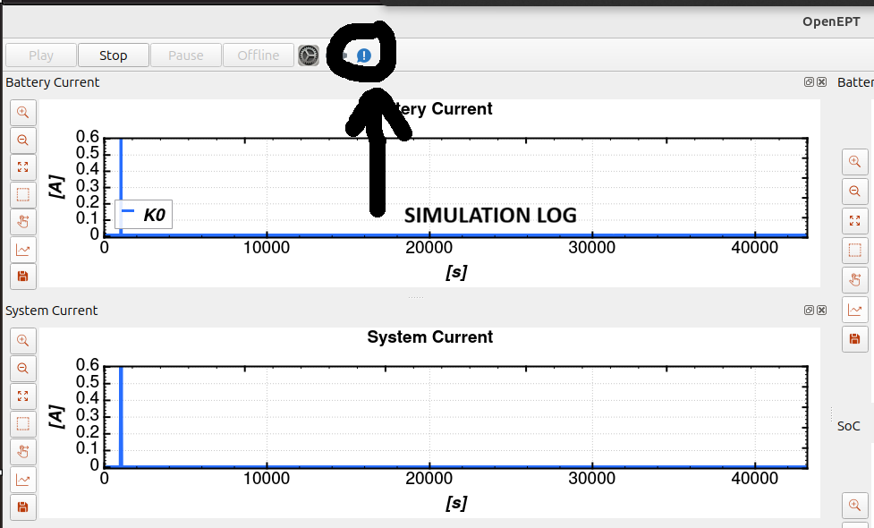
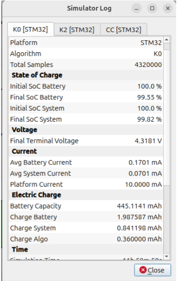

# Battery Software Simulator (BSS)

## Table of Contents

* [Overview](#overview)
* [Framework Architecture](#framework-architecture)
* [Backend Description](#backend-description)

  * [Battery Current Generator (BCG)](#battery-current-generator-bcg)
  * [Voltage Estimator](#voltage-estimator)
  * [Algorithm Block](#algorithm-block)
  * [Noise Generator](#noise-generator)
  * [SoC Reference Module](#soc-reference-module-socref)
  * [Parameter Tables](#parameter-tables)
  * [Data Logging and File Parser](#data-logging-and-file-parser)
* [Algorithm Integration](#algorithm-integration)

  * [Implemented Algorithms](#implemented-algorithms)
  * [Adding a New Algorithm](#adding-a-new-algorithm)
* [Frontend Description](#frontend-description)

  * [Getting Started](#getting-started)
  * [Main GUI](#main-gui)
  * [Simulation Configuration](#simulation-configuration)
  * [Running the Simulation](#running-the-simulation)
  * [Simulation Display Settings](#simulation-display-settings)
  * [Simulation Log and Post-Processing](#simulation-log-and-post-processing)

---

# Overview

The Battery Software Simulator (BSS) is a software framework designed for system-level evaluation of battery-powered embedded applications and State of Charge (SoC) estimation algorithms.

The framework consists of two primary components:

* A **simulation backend**, responsible for modeling software execution, battery dynamics, current consumption, and timing behavior.
* A **graphical frontend**, providing an interactive environment for simulation configuration, visualization, and result analysis.

Together, these components enable reproducible evaluation of battery-management algorithms under realistic operating conditions while accounting for both software execution costs and battery behavior.

Complete source code is available at:

https://github.com/OpenEPT/BSS

---

# Framework Architecture

To describe the interaction between software execution and hardware power dynamics, the backend is implemented as a modular sample-by-sample simulation environment.

The overall architecture, signal interconnections, and functional modules are shown in Figure 1.



**Figure 1.** Overall architecture of the simulation framework.

---

# Backend Description

The simulation backend models the interaction between battery-powered hardware platforms and software algorithms executed within the system.

Each simulation step represents a discrete-time execution cycle during which software execution, battery dynamics, and system measurements are synchronized.

The framework is composed of several interconnected modules responsible for current generation, battery voltage estimation, algorithm execution, noise injection, reference generation, and result logging.

---

## Battery Current Generator (BCG)

The Battery Current Generator (BCG) is the first execution block in the framework.

The baseline current (*Isys*) represents the platform current consumption excluding the evaluated algorithm. Based on execution-state flags received from the Algorithm Block, the BCG either forwards the baseline current unchanged or adds the current contribution associated with algorithm execution.

The generated signal therefore represents the effective battery load current and serves as the primary input to the battery model.

---

## Voltage Estimator

The resulting current profile is processed by the Voltage Estimator, which computes the corresponding battery terminal voltage.

The estimator is based on the Dual Polarization (DP) battery model, which captures both transient and steady-state battery behavior using two RC polarization networks representing fast and slow dynamic processes.

After computation, the module generates the **VEDone** synchronization signal, indicating that valid voltage and current information are available to the remaining simulator components.

---

## Algorithm Block

The Algorithm Block represents the software execution layer of the framework.

It executes user-defined algorithms using a structured execution pipeline consisting of:

1. Preprocessing
2. Processing
3. Postprocessing

At the beginning of each simulation cycle, the block receives current and voltage information from the BCG and Voltage Estimator.

Based on the selected operating mode, one of three execution-state flags is generated:

* **P (Parallel Execution)** – algorithm executes concurrently with baseline system activity.
* **S (Sequential Execution)** – algorithm executes independently of baseline system activity.
* **N (No Execution)** – algorithm remains inactive.

The selected flag is latched and remains active during the complete execution cycle while simultaneously controlling the behavior of the BCG.

During the processing stage, the selected algorithm executes according to timing information stored in the Algorithm Duration Table.

After execution, the postprocessing stage synchronizes the framework using the **PPDone** signal, updates outputs, computes energy consumption, clears execution flags, and prepares the simulator for the next cycle.

The framework therefore enables realistic modeling of software-induced battery consumption while preserving deterministic execution behavior.

---

## Noise Generator

To emulate realistic operating conditions, the framework includes a Noise Generator module.

The module introduces configurable stochastic disturbances into current and voltage measurements, allowing evaluation of algorithm robustness under sensor inaccuracies and measurement uncertainty.

This functionality is particularly useful when validating SoC estimation algorithms.

---

## SoC Reference Module (SoCRef)

The SoCRef module generates a reference State of Charge trajectory used as ground truth during evaluation.

The reference value is computed using an ideal Coulomb counting method operating at the maximum simulation update rate.

Although Coulomb counting may accumulate integration errors over long operating periods, the high update frequency minimizes this effect, making the reference suitable for both lifetime estimation and algorithm validation.

---

## Parameter Tables

Several simulator components are implemented as lookup tables containing experimentally obtained characterization data.

### Battery Parameters Table

Stores battery-model parameters such as:

* Capacity
* Internal resistance
* Polarization parameters
* Open-circuit voltage characteristics

### Platform Current Table

Contains current-consumption measurements corresponding to different operating states of the target hardware platform.

### Algorithm Duration Table

Stores execution-time measurements for supported algorithms.

Together, these tables provide the fundamental characterization data required for realistic battery-consumption simulation.

---

## Data Logging and File Parser

All system-level signals generated within the framework are continuously exposed as simulation outputs.

These include:

* Battery voltage
* Battery current
* System current
* Platform current
* State of Charge
* Execution-state flags
* Timing information
* Energy-consumption metrics

A dedicated File Parser module records simulation results and exports them into structured files suitable for post-processing and visualization.

---

# Algorithm Integration

## Implemented Algorithms

The current version of the framework includes implementations of:

* Coulomb Counter (CC)
* K0 estimator
* K2 estimator

Before integration into the framework, all algorithms were executed on an STM32F476RG embedded platform to characterize their execution-time and energy-consumption behavior.

Using the measurement setup described in the associated publication, the following execution times were obtained:

| Algorithm | Execution Time |
| --------- | -------------- |
| CC        | ~10 µs         |
| K0        | ~1.5 ms        |
| K2        | ~5 ms          |

The platform current consumption during active operation was approximately 10 mA.

All implemented algorithms operate on a standardized input interface consisting of:

* Battery current (*IBat*)
* Battery voltage (*VBat*)
* Battery State of Charge (*SoCBat*)

The estimated SoC value generated by the selected algorithm is exposed through a dedicated output variable and made available to the entire simulation environment.

Currently, all implemented algorithms execute using the **Parallel Execution (P)** mode.

---

## Adding a New Algorithm

The framework is designed to simplify integration of new battery-management and State of Charge (SoC) estimation algorithms.

All algorithms are executed through the common `Algorithm Block`, which provides a unified execution environment and standardized access to simulation variables such as:

* Battery current (*IBat*)
* Battery voltage (*VBat*)
* Battery State of Charge (*SoCBat*)

To integrate a new algorithm, the user typically needs to:

1. Add a new algorithm identifier to the algorithm enumeration.
2. Initialize algorithm-specific data structures within the initialization stage.
3. Implement the estimation logic inside the processing stage of the Algorithm Block.
4. Add the corresponding execution-time information to the Algorithm Duration Table.
5. Register the algorithm within the configuration interface.

Once integrated, the algorithm automatically participates in the framework execution cycle:

```text
Preprocessing
      ↓
 Processing
      ↓
Postprocessing
```

The framework handles scheduling, synchronization, battery interaction, energy-consumption accounting, data logging, and visualization automatically. Therefore, developers only need to implement the algorithm-specific estimation logic while all system-level execution management remains unchanged.


---

# Frontend Description

The frontend provides an intuitive graphical interface for simulation configuration, execution, visualization, and post-processing.

---

# Getting Started

Launch the application executable to start the simulator.

## Step 1 – Measurement Logging

When the application starts, the dialog shown in Figure 2 appears.



**Figure 2.** Measurement logging dialog.

This window asks whether simulation measurements should be saved.

---

## Step 2 – Framework Launcher

After confirming the previous dialog, the launcher window shown in Figure 3 appears.


**Figure 3.** Framework launcher.

Click the highlighted button to open the simulator GUI.

These initialization steps are required because the simulator is integrated into the OpenEPT project as an independent framework.

---

# Main GUI

The main simulation interface is shown in Figure 4.



**Figure 4.** Main simulation GUI.

The GUI consists of:

* Toolbar
* Real-time plotting area
* Log console
* Status bar

The plotting area visualizes:

* Battery current
* System current
* Platform current
* Terminal voltage
* State of Charge (SoC)

Interactive zooming, panning, and data export are supported.

The status bar continuously displays simulation progress and active configuration information.

---

# Simulation Configuration

Before running a simulation, open the Configuration Window using the button shown in Figure 5.

<p align="center">
  
</p>

<p align="center">
<b>Figure 5a.</b> Configuration window button.
</p>

<p align="center">
  
</p>

<p align="center">
<b>Figure 5b.</b> Configuration window interface.
</p>

---

The configuration interface allows customization of:

### Plot Selection

Selection of signals displayed in the GUI.

### Input Files

* Current profile
* OCV polynomial
* OCV curve
* Battery parameters
* Noise profiles
* Algorithm flag files

### Analysis Mode

* Online
* Offline

### Simulation Conditions

* Initial conditions
* Stop conditions
* Simulation limits

### Platform and Algorithm Selection

* Battery model
* Hardware platform
* Algorithm
* Execution mode

After configuration, press **OK**.


---

# Running the Simulation

Start the simulation using the **PLAY** button located in the main GUI toolbar.

The simulation progress can be monitored through the status bar.

---

# Simulation Display Settings

To configure which algorithm results are displayed, open the Simulation Display Settings window using the button shown in Figure 6.

<p align="center">
  
</p>

<p align="center">
<b>Figure 6a.</b> Simulation display settings button.
</p>

<p align="center">
  
</p>

<p align="center">
<b>Figure 6b.</b> Simulation display settings interface.
</p>

---

The display settings window allows users to:

* Display all algorithms simultaneously
* Display selected algorithms only
* Switch between algorithms for detailed analysis

This enables flexible comparison of multiple SoC estimation methods within the same simulation run.

---

# Simulation Log and Post-Processing

Detailed numerical analysis is available through the Simulation Log Window.

<p align="center">
  
</p>

<p align="center">
<b>Figure 8a.</b> Simulation log button.
</p>

<p align="center">
  
</p>

<p align="center">
<b>Figure 8b.</b> Simulation log interface.
</p>

---

After simulation completion, the log module provides:

### Electrical Quantities

* Battery current
* System current
* Platform current
* Terminal voltage

### Timing Metrics

* Execution statistics
* Runtime information
* Simulation duration

### Energy Consumption Statistics

* Algorithm energy consumption
* Platform energy consumption
* Battery utilization metrics

### SoC Performance Indicators

* Estimated SoC
* Reference SoC
* SoC deviation

### Statistical Error Metrics

* RMSE
* MAE
* Bias
* Additional performance indicators

These metrics enable comprehensive quantitative evaluation of algorithm accuracy, computational cost, and battery impact under realistic operating conditions.